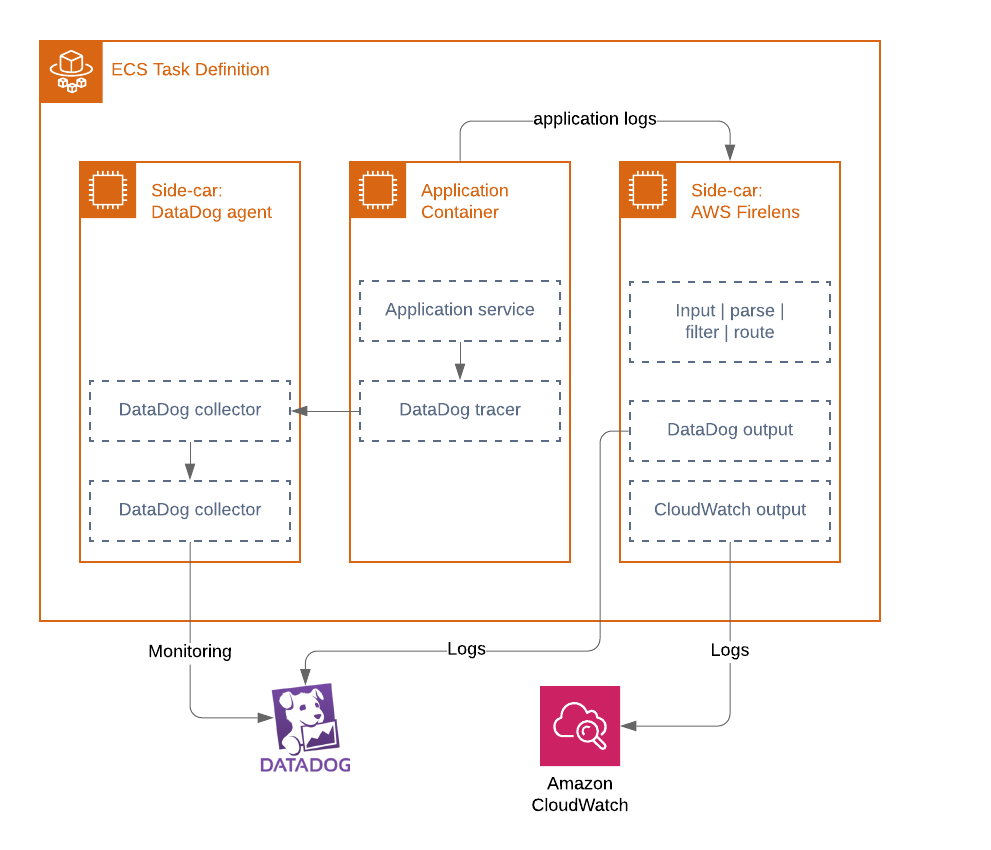

# Fargate task definition

<!-- START doctoc generated TOC please keep comment here to allow auto update -->
<!-- DON'T EDIT THIS SECTION, INSTEAD RE-RUN doctoc TO UPDATE -->

- [Description](#description)
  - [Side-cars](#side-cars)
  - [CI/CD compatibility](#cicd-compatibility)
  - [SSM parameter verifications](#ssm-parameter-verifications)
- [Limitations](#limitations)
  - [config-file-type:s3](#config-file-types3)
- [References](#references)
  - [CloudPosse terraform-aws-ecs-container-definition](#cloudposse-terraform-aws-ecs-container-definition)
  - [awslogs](#awslogs)
  - [DataDog integration](#datadog-integration)
  - [AWS FireLens](#aws-firelens)
- [Requirements](#requirements)
- [Providers](#providers)
- [Inputs](#inputs)
- [Outputs](#outputs)

<!-- END doctoc generated TOC please keep comment here to allow auto update -->

## Description
Terraform module to generate well-formed JSON documents that are passed to the aws_ecs_task_definition Terraform resource
as [container definitions](https://docs.aws.amazon.com/AmazonECS/latest/developerguide/task_definition_parameters.html#container_definitions).
Wraps CloudPosse's module with additional features.

### Side-cars
Thr application container can be built with a DataDog APM binary and bundled with side-cars:
* DataDog monitoring agent (optional)
* AWS Firelens for log forwarding using a fluent-bit output plugin for DataDog or CloudWatch logs.

### CI/CD compatibility
For existing ECS tasks, CI/CD pipelines will create new revisions for each image built,
tagged and deployed to ECS. The terraform state will remain on the old task def revision and will revert ECS to old revision.
- When variable image_tag is set, the container image tag is 'hard-coded'. This is required for the initial creation of a ECS task definition.
- When variable image_tag is not set, the module will look up and reuse the image tag from the existing active task definition.

### SSM parameter verifications
SSM parameters are validated to avoid failing ECS deployments.
The values are parsed to find name part of SSM parameter ARNs only.

## Limitations
- AWS FireLens can be configured to ship logs directly to ElasticSearch, but this configuration is not implemented in this module yet.
- ECS can also look up secrets from Secrets Manager. This is not supported by module.

### config-file-type:s3

When customer DevOps use DataDog to correlate application logs with metrics,
it may introduce compliance issues not having all logs in CloudWatch.

Firelens is able to ship logs to
[multiple destinations](https://github.com/aws-samples/amazon-ecs-firelens-examples/tree/master/examples/fluent-bit/send-to-multiple-destinations).

HOWEVER, as
[stated](https://docs.aws.amazon.com/AmazonECS/latest/developerguide/using_firelens.html#firelens-taskdef):
"For tasks using the Fargate launch type, the only supported
config-file-type value is file." **NOT config-file-type:s3.**

This means that custom configs must be added to a custom built docker
image. The custom fluent-bit config supports environment variables, so
that parameters for the DataDog and CloudWatch output plugins can be
altered across TEST/STAGE/PROD, but this demands a heap of moving pieces
and can be error prone.

## References

### CloudPosse terraform-aws-ecs-container-definition

- https://registry.terraform.io/modules/cloudposse/ecs-container-definition/aws/

### awslogs

- https://github.com/docker/docker.github.io/blob/master/config/containers/logging/awslogs.md
- https://github.com/aws/amazon-ecs-agent/issues/1192

### DataDog integration

- DataDog monitoring of ECS Fargate is configured according to
  https://docs.datadoghq.com/integrations/ecs_fargate/#web-ui
- About docker_labels, see
  https://docs.datadoghq.com/integrations/faq/integration-setup-ecs-fargate
- About Container Discovery Management, see
  https://docs.datadoghq.com/agent/autodiscovery/management/?tab=containerizedagent

### AWS FireLens

- https://aws.amazon.com/blogs/containers/under-the-hood-firelens-for-amazon-ecs-tasks
- https://docs.aws.amazon.com/AmazonECS/latest/developerguide/using_firelens.html
- https://docs.fluentbit.io/manual/output/datadog
- https://www.datadoghq.com/blog/multiline-logging-guide
- https://github.com/aws-samples/amazon-ecs-firelens-examples/blob/master/examples/fluent-bit/datadog/task-definition.json

<!-- BEGINNING OF PRE-COMMIT-TERRAFORM DOCS HOOK -->
## Requirements

| Name | Version |
|------|---------|
| terraform | >= 0.12.7, < 0.14 |
| aws | >= 2.7, < 4.0 |

## Providers

| Name | Version |
|------|---------|
| aws | >= 2.7, < 4.0 |

## Inputs

| Name | Description | Type | Default | Required |
|------|-------------|------|---------|:--------:|
| cloudwatch\_log\_group | Name of the log group | `string` | `null` | no |
| cluster\_name | ECS cluster name | `string` | n/a | yes |
| container\_depends\_on | The dependencies defined for container startup and shutdown. A container can contain multiple dependencies. When a dependency is defined for container startup, for container shutdown it is reversed. The condition can be one of START, COMPLETE, SUCCESS or HEALTHY | <pre>list(object({     containerName = string     condition     = string   }))</pre> | `null` | no |
| container\_name | The name of container. Use when container name differs from service name | `string` | `""` | no |
| cpu | The number of cpu units to reserve for the container. This is optional for tasks using Fargate launch type and the total amount of container\_cpu of all containers in a task will need to be lower than the task-level cpu value | `number` | `0` | no |
| datadog\_apm\_enable | When set to true, the Datadog Agent accepts trace metrics | `bool` | `true` | no |
| datadog\_docker\_labels | Docker labels used by DataDog agent for auto-discovery [doc](https://docs.datadoghq.com/agent/autodiscovery/basic_autodiscovery?tab=docker) | `map(string)` | `null` | no |
| datadog\_domain | The default public endpoint endpoint is in US | `string` | `"datadoghq.com"` | no |
| datadog\_environment | Customer environment variables used by DataDog agent [doc](https://docs.datadoghq.com/agent/docker/?tab=standard#environment-variables) | <pre>list(object({     name  = string     value = string   }))</pre> | `[]` | no |
| datadog\_image\_url | URL to datadog-agent docker image | `string` | `"datadog/agent:latest"` | no |
| datadog\_logcollection\_enable | Monitor Fargate logs by using the AWS FireLens integration built on Datadogs Fluentbit output plugin to send logs to Datadog | `bool` | `true` | no |
| datadog\_logcollection\_source | The source option will automatically trigger a log processing pipeline in Datadog for your integration [if available](https://docs.datadoghq.com/integrations/#cat-log-collection). | `string` | `"php"` | no |
| datadog\_process\_enable | Enable the DataDog process agent | `bool` | `true` | no |
| datadog\_tags | Map of tags sent to DataDog | `map` | `{}` | no |
| docker\_labels | The configuration options to send to the `docker_labels` of main container | `map(string)` | `null` | no |
| environment | The environment variables to pass to the container | <pre>list(object({     name  = string     value = string   }))</pre> | `null` | no |
| environment\_files | One or more files containing the environment variables to pass to the container. This maps to the --env-file option to docker run. The file must be hosted in Amazon S3. | <pre>list(object({     value = string     type  = string   }))</pre> | `null` | no |
| healthcheck | A map containing command (string), timeout, interval (duration in seconds), retries (1-10, number of times to retry before marking container unhealthy), and startPeriod (0-300, optional grace period to wait, in seconds, before failed healthchecks count toward retries) | <pre>object({     command     = list(string)     retries     = number     timeout     = number     interval    = number     startPeriod = number   })</pre> | `null` | no |
| image\_tag | Docker image tag. Used to initiate new task definition from scratch using image:latest or when CI/CD processes does not update tags in container definitions. | `string` | `""` | no |
| logcollection\_parsejson | Parse container log output as JSON [doc](https://github.com/aws-samples/amazon-ecs-firelens-examples/tree/master/examples/fluent-bit/parse-json) | `bool` | `false` | no |
| map\_environment | The environment variables to pass to the container. This is a map of string: {key: value}, environment override map\_environment | `map(string)` | `null` | no |
| memory | The amount of memory (in MiB) to allow the container to use. This is a hard limit, if the container attempts to exceed the container\_memory, the container is killed. This field is optional for Fargate launch type and the total amount of container\_memory of all containers in a task will need to be lower than the task memory value | `number` | `null` | no |
| memory\_reservation | The amount of memory (in MiB) to reserve for the container. If container needs to exceed this threshold, it can do so up to the set container\_memory hard limit | `number` | `null` | no |
| mount\_points | Container mount points. This is a list of maps, where each map should contain a `containerPath` and `sourceVolume` | <pre>list(object({     containerPath = string     sourceVolume  = string   }))</pre> | `[]` | no |
| name | The name of the service. Up to 255 characters (a-z, A-Z, 0-9, -, \_ allowed) | `string` | n/a | yes |
| port\_mappings | The port mappings to configure for the container. This is a list of maps. Each map should contain "containerPort", "hostPort", and "protocol", where "protocol" is one of "tcp" or "udp". If using containers in a task with the awsvpc or host network mode, the hostPort can either be left blank or set to the same value as the containerPort | <pre>list(object({     containerPort = number     hostPort      = number     protocol      = string   }))</pre> | <pre>[   {     "containerPort": 80,     "hostPort": 80,     "protocol": "tcp"   } ]</pre> | no |
| repo | Docker repo | `string` | n/a | yes |
| secrets | The SSM parameters to pass to the container | <pre>list(object({     name      = string     valueFrom = string   }))</pre> | `null` | no |
| ssm\_datadog\_api\_key | Path to SSM parameter storing the encrypted DataDog API key | `string` | `null` | no |
| task\_definition\_name | The name of task definition. Use when task definition name differs from service name | `string` | `""` | no |
| volumes\_from | A list of VolumesFrom maps which contain "sourceContainer" (name of the container that has the volumes to mount) and "readOnly" (whether the container can write to the volume) | <pre>list(object({     sourceContainer = string     readOnly        = bool   }))</pre> | `[]` | no |

## Outputs

| Name | Description |
|------|-------------|
| json | JSON encoded list of container definitions for use with other terraform resources such as aws\_ecs\_task\_definition |
| json\_app\_only | JSON encoded list of container definition without DataDog side-car |
| json\_objects\_map | Map of container definitions |

<!-- END OF PRE-COMMIT-TERRAFORM DOCS HOOK -->
